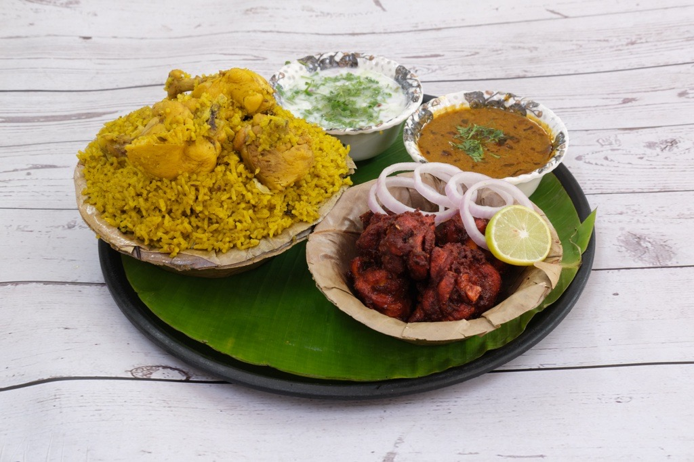

# Brothers Biriyani - Premium Restaurant Website 🍛

A beautiful, modern, and responsive restaurant landing page built with React, TypeScript, Vite, and Tailwind CSS.



## 🌟 Features

- **Premium Design**: Modern, elegant design with authentic Indian restaurant aesthetics
- **Fully Responsive**: Optimized for desktop, tablet, and mobile devices
- **Smooth Animations**: Framer Motion animations for engaging user experience
- **Component-Based**: Clean, reusable React components with TypeScript
- **Fast Performance**: Built with Vite for lightning-fast development and builds
- **SEO Optimized**: Proper meta tags and semantic HTML structure

## 🎨 Color Palette

The color scheme is derived from authentic Indian biriyani imagery:

- **Golden Yellow** (#EAB308): Primary brand color (turmeric/rice)
- **Deep Red** (#DC2626): Accent color (spices/kebabs)
- **Vibrant Green** (#22C55E): Accent color (herbs/banana leaves)
- **Charcoal** (#1F2937): Background
- **Warm Orange** (#F97316): Secondary accent

## 📦 Tech Stack

- **React 18** - UI library
- **TypeScript** - Type safety
- **Vite** - Build tool and dev server
- **Tailwind CSS** - Utility-first CSS framework
- **Framer Motion** - Animation library
- **Lucide React** - Icon library

## 🚀 Getting Started

### Prerequisites

- Node.js 18+ installed
- npm or yarn package manager

### Installation

1. Navigate to the project directory:
```bash
cd brothers-biriyani
```

2. Install dependencies:
```bash
npm install
```

3. Start the development server:
```bash
npm run dev
```

4. Open your browser and navigate to `http://localhost:5173`

## 📁 Project Structure

```
brothers-biriyani/
├── public/
│   └── images/              # Food images
├── src/
│   ├── components/          # React components
│   │   ├── Navbar.tsx
│   │   ├── Hero.tsx
│   │   ├── FoodCard.tsx
│   │   ├── MenuSection.tsx
│   │   ├── AboutSection.tsx
│   │   ├── WhyChooseUs.tsx
│   │   ├── Gallery.tsx
│   │   ├── Testimonials.tsx
│   │   ├── CTASection.tsx
│   │   └── Footer.tsx
│   ├── App.tsx              # Main app component
│   ├── main.tsx             # Entry point
│   └── index.css            # Global styles
├── index.html
├── tailwind.config.js
├── vite.config.ts
└── package.json
```

## 🛠️ Build for Production

```bash
npm run build
```

The optimized production build will be in the `dist/` directory.

## 📱 Sections

1. **Hero Section** - Eye-catching header with CTA buttons
2. **Menu Section** - Showcase of delicious dishes with prices
3. **About Section** - Brand story and statistics
4. **Why Choose Us** - Key features and benefits
5. **Gallery** - Visual showcase of food photography
6. **Testimonials** - Customer reviews and ratings
7. **Contact/CTA** - Contact information and order CTA
8. **Footer** - Links, social media, and additional info

## 🎯 Customization

### Update Contact Information

Edit the following files:
- `src/components/Navbar.tsx` - Phone number
- `src/components/CTASection.tsx` - Full contact details
- `src/components/Footer.tsx` - Footer contact info

### Add More Menu Items

Edit `src/components/MenuSection.tsx` and add items to the `menuItems` array:

```typescript
{
  name: 'Your Dish',
  description: 'Description',
  price: '$X.XX',
  image: '/images/your-image.jpeg',
  rating: 5,
  isPopular: true
}
```

### Change Colors

Edit `tailwind.config.js` to update the color palette:

```javascript
colors: {
  brand: {
    gold: '#YOUR_COLOR',
    // ... other colors
  }
}
```

## 🌐 Deployment

### Deploy to Netlify

1. Push your code to GitHub
2. Connect your repository to Netlify
3. Netlify will auto-detect Vite configuration
4. Deploy!

Or use Netlify CLI:
```bash
npm install -g netlify-cli
npm run build
netlify deploy --prod --dir=dist
```

### Deploy to Vercel

```bash
npm install -g vercel
vercel
```

## 📄 License

This project is open source and available under the [MIT License](LICENSE).

## 🤝 Contributing

Contributions, issues, and feature requests are welcome!

## 👨‍💻 Author

**Brothers Biriyani Team**

- Website: [brothersbiriyani.com](#)
- Email: info@brothersbiriyani.com
- Phone: +1 (234) 567-890

## 🙏 Acknowledgments

- Food images from Brothers Biriyani collection
- Icons from Lucide React
- Fonts from Google Fonts (Inter, Poppins)

---

Made with ❤️ and 🍛 by Brothers Biriyani
